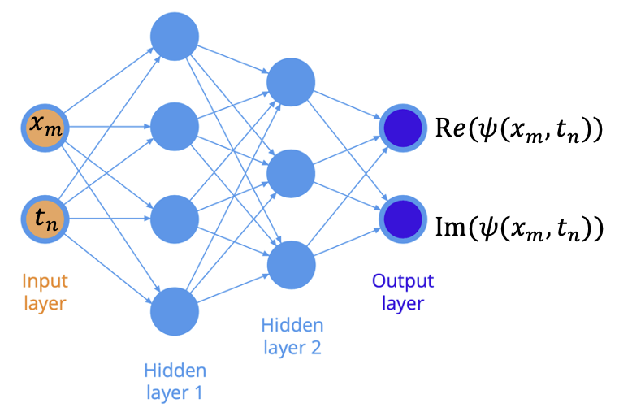

# Physical Informed Neural Network for a driven-damped NLSE
## Background
In the realm of nonlinear optics, the study of light-matter interactions in optical cavities has garnered significant interest due to its applications in various fields such as telecommunications, spectroscopy, and quantum computing. One of the fundamental equations describing the dynamics of the optical field in such systems is the Nonlinear Schrödinger Equation (NLSE). The Lugiato-Lefever Equation (LLE), a specific form of the driven-damped NLSE, models the behavior of light in a Kerr medium within an optical cavity, considering both dispersion and nonlinearity.

The LLE is pivotal for understanding phenomena like optical frequency comb generation, temporal cavity solitons, and pattern formation in nonlinear optical resonators. These phenomena have profound implications for the development of precise optical clocks, high-capacity data transmission systems, and advanced laser sources. The driven-damped nature of the LLE introduces additional complexity by accounting for the continuous injection of energy into the system and its subsequent dissipation, making it a rich subject for both theoretical and experimental investigations.

Traditional methods of solving the LLE involve numerical techniques which can be computationally intensive and sensitive to initial conditions. Recently, the advent of machine learning and, more specifically, Physics-Informed Neural Networks (PINNs) has provided a new paradigm for solving such differential equations. PINNs leverage the power of neural networks while embedding the physical laws governing the system into the learning process, thereby offering an efficient and potentially more accurate means of modeling complex dynamical systems like those described by the LLEs.

## Modeling: A driven-damped NLSE -- Lugiato-Lefever Equation

The Lugiato-Lefever equation is a partial differential equation used in nonlinear optics to describe the field inside an optical cavity. It is given by:

$$
i\frac{\partial \psi(t, \theta)}{\partial t} = \delta \psi(t, \theta) -  \frac{D_2}{2}\partial^2_\theta \psi(t, \theta) - g|\psi(t, \theta)|^2 \psi(t,\theta)  + i\frac{\kappa}{2}\left(\psi(t, \theta)-h \right)
$$

where:

- $\psi(t, \theta)$ is the complex field envelope,
- $t$ is the slow time variable,
- $\theta$ is the spatial variable,
- $D_2$ is the group velocity dispersion coefficient (higher dispersions are omitted),
- $\kappa$ is the cavity loss rate,
- $g$ is the Kerr coefficient,
- $\delta = \omega_0 - \omega_p$ is the cavity detuning between laser and pump,
- $h$ is the driving field amplitude.

This equation is a variant of the nonlinear Schrödinger equation (NLSE) with additional terms to account for cavity effects and external driving. The forms of dispersion and nonlinearity should be revised per materials and other factors, and here we assume the higher-order dispersion is weak in a Kerr medium.

   <figure style="text-align: center;">
     
     <figcaption> Optical frequency comb, Science, 361, 567 (2018)
 </figcaption>
   </figure>

### Comprehensive Understanding of the LLE

The Lugiato-Lefever Equation can seem complex at first glance, so let's break it down with a few examples and intuitive explanations.

1. **Optical Frequency Combs:**
   Optical frequency combs are spectra consisting of a series of discrete, equally spaced elements. They are crucial for high-precision measurements and have applications in spectroscopy, telecommunications, and the development of optical clocks. The LLE helps in understanding how these combs can be generated within an optical cavity. When a continuous wave laser is coupled into a nonlinear optical resonator, the interaction between the dispersion and the Kerr nonlinearity (intensity-dependent refractive index) described by the LLE can lead to the formation of a stable frequency comb.

2. **Temporal Cavity Solitons:**
   Temporal cavity solitons are stable pulses of light that can circulate indefinitely within an optical cavity. These solitons are solutions to the LLE and are formed due to a balance between dispersion, nonlinearity, and the driven-damped nature of the system. Imagine a single pulse of light that maintains its shape and energy as it circulates inside the cavity, thanks to the precise balance of the LLE terms. These solitons can be used in optical communication systems to transmit information over long distances without distortion.

3. **Pattern Formation:**
   The LLE also explains how certain patterns of light can form in an optical cavity. These patterns result from the interplay between the nonlinearity and dispersion in the medium. For example, under certain conditions, the light field within the cavity can spontaneously break symmetry and form periodic patterns or localized structures. This phenomenon is similar to how ripples form on the surface of a pond when disturbed.

   <figure style="text-align: center;">
     
     <figcaption> Patterns and solitons, Nat. Photon., 2013, 343 (2014)
 </figcaption>
   </figure>

### Practical Example

Let's consider a simple analogy to understand the LLE. Imagine you're pushing a swing (the light field) in a playground. The swing has a natural frequency (resonance), and you push it at this frequency (driving force). If you push too hard (high driving amplitude), the swing will move erratically, but if you push just right, it will swing back and forth smoothly. Now, if the swing's chain is stretchy (nonlinearity), the swing's frequency will change depending on how high it goes. Additionally, if there's a little friction (loss), you need to keep pushing to maintain the swing's motion.

## Mature numerical methods

When it comes to simulating the Lugiato-Lefever Equation, several mature numerical methods are commonly employed to achieve accurate and efficient solutions. Two of the most widely used methods are the Runge-Kutta method and the Split-Step Fourier method.

### Runge-Kutta Method

The Runge-Kutta method is a family of iterative methods for approximating the solutions to ordinary differential equations (ODEs). The fourth-order Runge-Kutta method (RK4) is particularly popular due to its balance between accuracy and computational efficiency. For the Lugiato-Lefever Equation, which involves partial differential equations (PDEs), the method can be adapted to handle the temporal evolution of the system. Here’s a basic outline of how the RK4 method works:

1. **Initial Conditions:** Start with an initial field $\psi(t=0, \theta)$.
2. **Iterative Steps:** For each time step $t \rightarrow t + \Delta t$:
   - Compute intermediate values (slopes) at different points within the time step.
   - Combine these slopes to obtain a weighted average that estimates the field at the next time step.
3. **Update Field:** Update the field $\psi(t, \theta)$ using the weighted average of slopes.

This method is advantageous for its simplicity and accuracy but can become computationally expensive for large-scale simulations due to the need for small time steps to maintain stability.

### Split-Step Fourier Method

The Split-Step Fourier method is a specialized technique for solving nonlinear PDEs, particularly useful for equations like the NLSE and LLE that involve both linear and nonlinear terms. The method separates (splits) the linear and nonlinear parts of the equation and solves them in a stepwise manner using Fourier transforms. Here’s an outline of the process:

1. **Initial Conditions:** Start with an initial field $\psi(t=0, \theta)$.
2. **Linear Step:** Apply the linear part of the LLE in the Fourier domain. This involves:
   - Transforming the field to the Fourier domain using the Fast Fourier Transform (FFT).
   - Evolving the field according to the linear dispersion relation.
   - Transforming back to the time/spatial domain using the inverse FFT.
3. **Nonlinear Step:** Apply the nonlinear part of the LLE in the time/spatial domain. This involves:
   - Updating the field according to the nonlinear interaction term.
4. **Iterate:** Repeat the linear and nonlinear steps for each time step $t \rightarrow t + \Delta t$.

The Split-Step Fourier method is highly efficient for handling the dispersion and nonlinearity separately, allowing for larger time steps compared to the Runge-Kutta method. It is particularly well-suited for problems where the dispersion relationship can be easily handled in the Fourier domain.

By employing these mature numerical methods, researchers can effectively simulate the dynamics described by the Lugiato-Lefever Equation, gaining insights into the complex behaviors of optical fields in nonlinear cavities.

## Physics-Informed Neural Network

Physics-Informed Neural Networks (PINNs) represent a cutting-edge approach to solving differential equations, including the Lugiato-Lefever Equation, by integrating physical laws into the machine learning framework. This section provides an overview of PINNs and their application to modeling the Lugiato-Lefever Equation.

### Introduction to PINNs

Traditional neural networks are trained using data to learn the underlying patterns and make predictions. In contrast, PINNs incorporate the governing physical equations directly into the loss function of the neural network. This integration allows the network to learn not only from data but also from the fundamental principles of the physical system, leading to more accurate and physically consistent predictions.

### Key Components of PINNs

1. **Neural Network Architecture:**
   A typical PINN consists of a feedforward neural network with multiple hidden layers. The input to the network can include spatial and temporal variables, while the output is the predicted field $\psi(t, \theta)$.
   

      <figure style="text-align: center;">
        
        <figcaption> A simple MLP network </figcaption>
      </figure>
   

3. **Loss Function:**
   The loss function in a PINN is composed of two main components:
   - **Data Loss:** This term measures the discrepancy between the network's predictions and any available observational data.
   - **Physics Loss:** This term ensures that the network's predictions satisfy the underlying physical equations (in this case, the Lugiato-Lefever Equation). The physics loss is computed by substituting the network's output into the differential equation and penalizing any deviation from zero.

The total loss is a weighted sum of the data initial loss, boundary loss and physics (PDE) loss:

$L_{Total} = L_{Init} + L_{BC} + L_{PDE}$

where:

- $L_{Init} = \frac{( ∑_{i=1}^{N_I} |\psi_{pred}^{i}(t=0) - \psi_{data}^{i}(t=0)|^2 )} { N_I}$ loss at initial time slot $t=0$, $i$ is the data point selected to train the model,
- $L_{BC} = \frac{∑_{i=1}^{N_{BC}} \left[ (\psi_{pred}^{i}(x=+BL) - \psi_{pred}^{i}(x=-BL))^2+(\partial_x \psi_{pred}^{i}(x=+BL)-\partial_x \psi_{pred}^{i}(x=-BL))^2\right]}{N_{BC}} $, where $BL, BC$ stands for $Boundary Limit, Condition$
- $L_{PDE} = \frac{ ∑_{i=1}^{N_{PDE}} f(\psi_{pred}^{i})^2 }{N_{PDE}}$, where $f(\psi)$ is our LLE model.

  
4. **Training Process:**
   The neural network is trained using gradient-based optimization techniques to minimize the total loss. This process adjusts the network's weights and biases to fit both the data and the physical model.

### Applying PINNs to the Lugiato-Lefever Equation

To apply PINNs to the Lugiato-Lefever Equation, the following steps are typically involved:

1. **Define the Neural Network:**
   Construct a neural network with appropriate input and output layers. The input layer should accept the time $t$ and spatial variable $\theta$, while the output layer should predict the complex field envelope $\psi(t, \theta)$.

2. **Formulate the Loss Function:**
   Incorporate the Lugiato-Lefever Equation into the loss function. The physics loss term can be derived by differentiating the network's output with respect to $t$ and $\theta$ and substituting these derivatives into the LLE.

3. **Data Preparation:**
   If available, prepare any observational or synthetic data to include in the data loss term. This data can provide additional guidance to the network during training.

4. **Train the Network:**
   Use an optimization algorithm (e.g., Adam or L-BFGS) to minimize the total loss function. The training process iteratively adjusts the network's parameters to reduce both the data loss and physics loss.

5. **Evaluate the Model:**
   After training, evaluate the performance of the PINN by comparing its predictions with known solutions or additional test data. Assess the accuracy and physical consistency of the results.

Here, we factorize the real and imaginary parts of the LLE by  $\psi=u+i\cdot v$, then the original model can be written in terms of the real and imaginary parts accordingly:

$f_u = u_t +\frac{D_2}{2}v_{xx} + g(u^2+v^2)v - \delta v +\frac{\kappa}{2}u - h$

$f_v = -v_t +\frac{D_2}{2}u_{xx} +g(u^2+v^2)u -\delta u -\frac{\kappa}{2}v$

### Advantages of PINNs

- **Reduced Data Dependency:**
  PINNs can effectively leverage physical laws, reducing the need for large amounts of training data.
  
- **Improved Generalization:**
  By incorporating physical principles, PINNs often produce acceptable precision and are much faster in high-dimensional computation compared to traditional data-driven models.

- **Physically Consistent Predictions:**
  The physics-informed approach ensures that the predictions adhere to the governing equations, leading to more reliable and interpretable results.

### Challenges and Future Directions

While PINNs offer numerous advantages, they also present certain challenges, such as the need for careful tuning of hyperparameters and the potential for increased computational complexity. Ongoing research aims to address these challenges and expand the applicability of PINNs to a broader range of physical systems.

In summary, Physics-Informed Neural Networks provide a powerful framework for solving the Lugiato-Lefever Equation, combining the strengths of machine learning with the rigor of physical laws. This approach holds great promise for advancing our understanding and modeling of complex dynamical systems in nonlinear optics and beyond.

